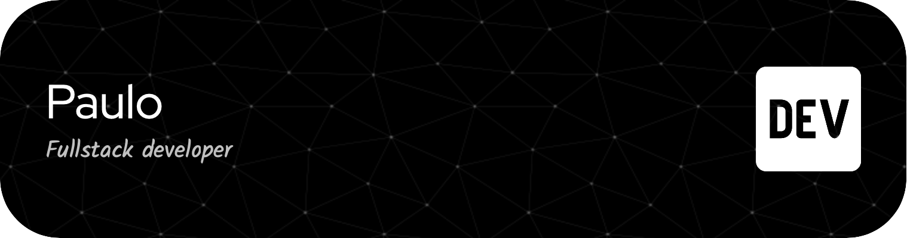

## Who am I

* Seasoned Systems Analyst with over 25 years’ diverse experience in the IT infrastructure project management – designing, implementing, and developing informational systems from scratch
Managed both support and development teams for many years using the best practices like Agile

## What I know

* I know that it is necessary to keep learning...

## I am currently working with

      

## I have worked with

        

* Microsoft Servers
* Cisco (routers, switches, VoIP...)
* Checkpoint

## I have studied

   

## Stats

## Find me

## This repo

-------------------------

Created by Paulo

<!--
**pepcmarques/pepcmarques** is a ✨ _special_ ✨ repository because its `README.md` (this file) appears on your GitHub profile.

Header - https://github.com/leviarista/github-profile-header-generator

Icons - https://devicon.dev

Stats - https://github.com/anuraghazra/github-readme-stats
      - https://github.com/vn7n24fzkq/github-profile-summary-cards
      - https://github.com/ryo-ma/github-profile-trophy

Profile Maker - https://github.com/VishwaGauravIn/github-profile-readme-maker
              - https://github.com/rahuldkjain/github-profile-readme-generator

Emojis - https://emojipedia.org
       - https://github.com/ikatyang/emoji-cheat-sheet

Shields - https://shields.io

Badges - https://github.com/VishwaGauravIn/pretty-readme-badges
       - https://github.com/alexandresanlim/Badges4-README.md-Profile

Some ideas....

Here are some ideas to get you started:

- 🔭 I’m currently working on ...
- 🌱 I’m currently learning ...
- 👯 I’m looking to collaborate on ...
- 🤔 I’m looking for help with ...
- 💬 Ask me about ...
- 📫 How to reach me: ...
- 😄 Pronouns: ...
- ⚡ Fun fact: ...
-->
